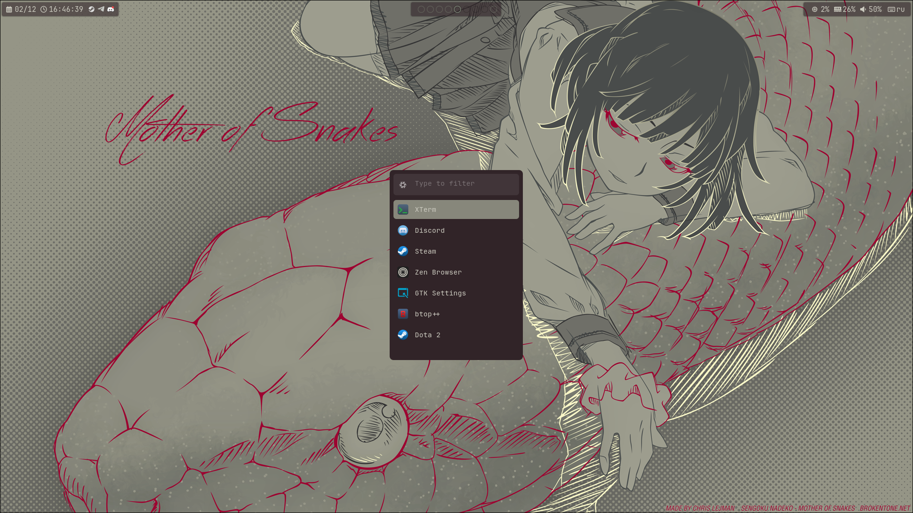
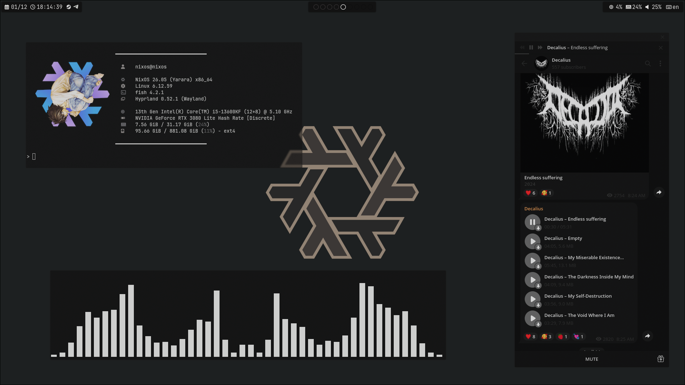
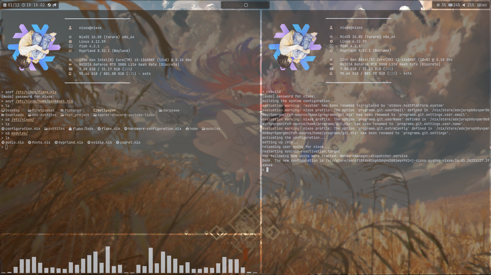

<div align="center">

# ✨ NixOS Dotfiles ✨

 *A beautiful, modern NixOS configuration with Hyprland*


[](https://nixos.org)
[](https://hyprland.org)
[](LICENSE)

[](https://github.com/ass-sudo/nix-dotfiles/stargazers)
[](https://github.com/ass-sudo/nix-dotfiles/network/members)

[Screenshots](#-screenshots) • [Features](#-features) • [Installation](#-installation) • [Aliases](#-shell-aliases)

---

</div>

## 📸 Screenshots

<div align="center">

| NVF & Workspace | Rofi & Terminal |
|:---------------:|:---------------:|
|  |  |
|  |  |

</div>

---

## 🎯 Features

<div align="center">

### 🖥️ Core Components

</div>

<table align="center">
<tr>
<td width="50%" valign="top">

#### 🪟 Window Manager & UI
- **Hyprland** - Dynamic tiling Wayland compositor
- **Waybar** - Highly customizable status bar
- **Rofi** - Application launcher & window switcher
- **Swww** - Efficient animated wallpaper daemon
- **Pywal** - Automatic color scheme generation

</td>
<td width="50%" valign="top">

#### 💻 Terminal & Shell
- **Kitty** - GPU-accelerated terminal emulator
- **Fish** - Smart and user-friendly shell
- **Zoxide** - Smarter cd command with frecency
- **FastFetch** - Lightning-fast system information
- **BTop** - Resource monitor with modern UI

</td>
</tr>
<tr>
<td width="50%" valign="top">

#### 🛠️ Development Tools
- **Vim/NVim** - Powerful text editors
- **NVF** - Neovim IDE with LSP support
- **Git** - Distributed version control
- **LSD** - Modern replacement for ls command

</td>
<td width="50%" valign="top">

#### 🎨 Applications
- **Zen Browser** - Privacy-focused web browser
- **Nemo** - Feature-rich file manager
- **GIMP** - Professional image editor
- **MPV** - Minimalist media player
- **Telegram** - Secure messenger
- **Steam** - Gaming platform

</td>
</tr>
</table>

---

## ⌨️ Bind

<div align="center">

| Keybind | Action | Keybind | Action |
|:-------:|:------:|:-------:|:------:|
| `SUPER + RETURN` | Open Terminal | `SUPER + Q` | Kill Window |
| `SUPER + R` | App Launcher | `SUPER + F` | Fullscreen |
| `SUPER + E` | File Manager | `SUPER + W` | Web Browser |
| `CTRL + SPACE` | Switch Language | `ALT + SHIFT + S` | Screenshot |
| `SUPER + SHIFT + D` | Telegram | `SUPER + SHIFT + W` | Steam |
| `SUPER + SHIFT + E` | GIMP | `CTRL + SHIFT + 1-0` | Change Wallpaper |
| `SUPER + SHIFT + ALT + S` | Sleep Mode | `SUPER + SHIFT + ALT + Q` | Power Off |

</div>

---

## 🔧 Shell Aliases

<div align="center">

| Alias | Command | Alias | Command |
|:-----:|:-------:|:-----:|:-------:|
| `ll` | `lsd -lah` | `la` | `lsd -a` |
| `ls` | `lsd` | `..` | `cd ..` |
| `...` | `cd ../..` | `grep` | `grep --color=auto` |
| `nvf` | `nix run github:notashelf/nvf` | `snvf` | `sudo nvf` |
| `gs` | `git status` | `ga` | `git add` |
| `gc` | `git commit` | `gp` | `git push` |
| `gcl` | `git clone` | `gpam` | `git push origin main` |
| `rebuild` | `sudo nixos-rebuild switch --flake /etc/nixos#nixos` | `cleanup` | `sudo nix-collect-garbage -d` |

</div>

---

## 📦 Installation

### Prerequisites
- Fresh NixOS installation
- Username: `nixos` **(recommended)**
- Basic understanding of Nix flakes

```bash
# 1️⃣ Install git
sudo nano /etc/nixos/configuration.nix
# Add to systemPackages: git
sudo nixos-rebuild switch

# 2️⃣ Clone this repository
git clone https://github.com/ass-sudo/nix-dotfiles.git
cd nix-dotfiles/nixos

# 3️⃣ Copy configuration files
sudo rm -rf /etc/nixos/configuration.nix
sudo cp -a configuration.nix dotfiles/ flake.lock flake.nix home/ modules/ /etc/nixos/

# 4️⃣ Rebuild
sudo nixos-rebuild switch --flake /etc/nixos#nixos

# 5️⃣ Reboot your system
reboot
```

---

### ⚠️ Important Notes

-Configure your monitor in Hyprland:
```bash
nano ~/.config/hypr/hyprland.conf
```

Example configuration:
```conf
monitor = DP-1, 1920x1080@165, 0x0, 1
# For multiple monitors:
# monitor = HDMI-A-1, 1920x1080@60, 1920x0, 1
```
- ✅ Use username **`nixos`** for best compatibility
- ⚠️ **Do not change** the layout switch from `ALT + SHIFT` (breaks keybindings)
- 🖥️ For multiple monitors, add additional `monitor` lines

---

### ⭐ Star this repo if you find it helpful!
<div align="center">
**Made with by [ass-sudo](https://github.com/ass-sudo)**
</div>

---

## 📝 License

This project is licensed under the **GNU General Public License v3.0**.

See the [LICENSE](LICENSE) file for details.

</div>
